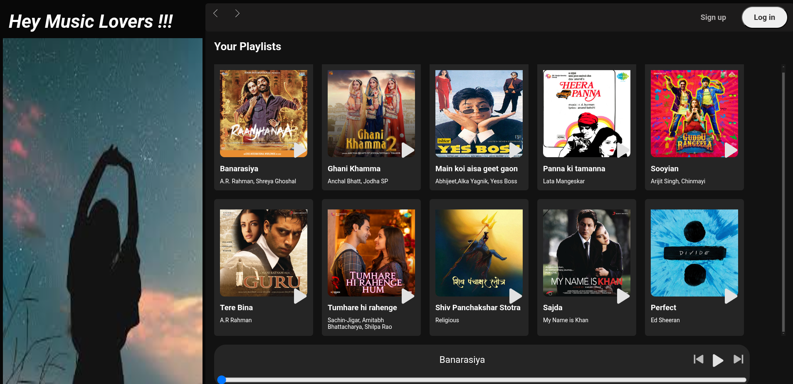
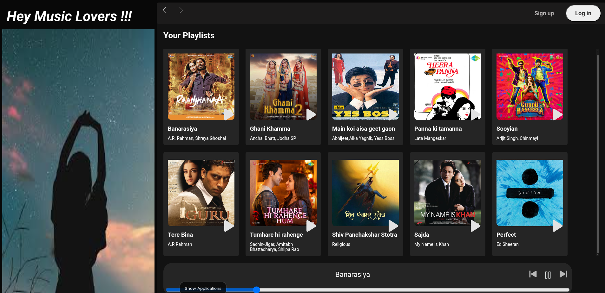

# 🎵 Music Player Web Application

A clean and responsive music player built using **HTML**, **CSS**, and **JavaScript**. It allows users to play, pause, skip, and control the volume of audio tracks in a modern UI.

## 🚀 Features

- Play/Pause audio
- Next and Previous track controls
- Seek bar and progress tracking
- Volume control
- Responsive design (mobile & desktop friendly)
- Playlist support (add multiple songs)

## 🛠️ Technologies Used

- **HTML5** – Markup for layout and audio player
- **CSS3** – Custom styling and responsive layout
- **JavaScript** – Player functionality and interactivity

## 📸 Screenshots

